# 🇵🇹 Anki Portuguese Automation — Unified README
## Status [](https://github.com/ksimons29/anki-portuguese-sayings/commits/main)

A clean, end-to-end pipeline that turns quick notes on your **iPhone, iPad, or Mac** into high-quality **Anki** cards—automatically.

> **NEW**: 🎨 **Interactive HTML Dashboard** — Get a beautiful, browser-based overview of your Portuguese vocabulary pulled directly from Anki! Features searchable categories (Gym, Dating, Work, Admin, Daily Life), stats, and full sentences. Auto-updates at 21:00 daily. See [Dashboard](#-interactive-html-dashboard) below.
>
> **NEW**: 🎙️ **Voice Memos Transcription** — Record longer Portuguese conversations on iPhone/iPad/Mac with built-in Portuguese transcription, then extract vocabulary into your learning pipeline. See [Voice Memos](#%EF%B8%8F-voice-memos-transcription-for-longer-conversations) below.
>
> **NEW**: 🎧 **Unified Transcribe (YouTube + audio inbox)** — Download YouTube audio or drop files in `Portuguese/Transcrições`, transcribe with Whisper via `unified_transcribe.py`, and mine the txt outputs for new words before sending them into the Anki inbox. See [Unified Transcribe](#-unified-transcribe-youtube-and-audio-inbox--transcripts) below.

- ✍️ **Capture** → use the Shortcut **Save to AnkiInbox** (prompts you to type or dictate a word in **Portuguese or English**).
- 🧠 **Normalize to a lemma** → smart rules + stopwords pick the meaningful keyword (see “Stopwords & Lemma Extraction” below).
- 🇵🇹 **Enrich with GPT** → generates **C1-level European Portuguese** translation and a 12–22-word example sentence.
- 🗂️ **Load into Anki** → notes are created via **AnkiConnect** using your `GPT Vocabulary Automater` note type.
- 🔄 **Sync everywhere** → study on mobile/tablet/laptop with Anki’s media sync.

> **Default deck:** `Portuguese Mastery (pt-PT)` (configurable).

---

## 🎙️ Capture Shortcut (Voice or Type)

This Shortcut is your single capture UI on **iPhone**, **iPad**, and **Mac**.

### How it works
- On run, you choose **Voice** or **Type**.  
  - If you pick **Voice**, select **Portuguese (Portugal)** or **English (US)** and speak a single word or short phrase.  
  - If you pick **Type**, enter the word/phrase manually.
- The Shortcut **appends exactly one JSON line** (newline-terminated) to your iCloud inbox — it **never overwrites** the file. 


### Inbox (JSONL) location
**Saves to:** `iCloud Drive/Portuguese/Anki/inbox/quick.jsonl`
**Example JSONL line:** `{"word":"telemóvel"}`

### Guarantees
* One entry, sentence or word, per run (append mode with newline)
* Stable, machine friendly format for downstream processing


---

## 🎨 Interactive HTML Dashboard

Get a **live, visual overview** of your Portuguese learning progress with a beautiful browser-based dashboard that pulls data **directly from your Anki deck**.

### ✨ Features

- **📊 Real-time Stats**: Total cards, this week, this month, number of categories
- **🗂️ Smart Categories**: Cards auto-classified into topics (💪 Gym, ❤️ Dating, 💼 Work, 📋 Admin, 🏡 Daily Life, 🔍 Other)
- **🔍 Live Search**: Instantly filter cards by typing Portuguese or English
- **📖 Full Context**: Shows both Portuguese and English words AND sentences
- **🎯 Expandable Sections**: Click any category to see all cards, collapse to hide
- **📅 Sorted by Date**: Most recent cards appear first in each category
- **🎨 Beautiful Design**: Purple gradient background, clean card layout, mobile-responsive
- **🔄 Auto-Updates**: Regenerates every evening at 21:00 when your pipeline runs

### 🚀 Quick Start

**One-time setup** (requires Anki to be running):

```bash
cd ~/anki-tools
git pull origin claude/apple-anki-portuguese-workflow-015jhBxxAsn9atLhGspFuobz
source .venv/bin/activate
python generate_dashboard_html.py
```

The dashboard will:
1. Open **Anki** automatically (if not already running)
2. Pull **all cards** from your `Portuguese Mastery (pt-PT)` deck via AnkiConnect
3. Classify cards into categories using bilingual keyword matching
4. Generate a beautiful HTML file in **iCloud Drive**: `Portuguese/Anki/Portuguese-Dashboard.html`
5. **Copy to Desktop** for easy Mac access
6. **Auto-open** in your default browser
7. **Auto-sync to iPhone/iPad** via iCloud Drive

### 📊 What You'll See

```
🇵🇹 Portuguese Learning Dashboard
Last updated: Wednesday, December 11, 2025 at 16:45
📊 Data source: Anki Database (Live)

┌─────────────────────────────────────────┐
│  627        23         89         6     │
│  Total    This Week  This Month Categories│
└─────────────────────────────────────────┘

🔍 Search words in Portuguese or English...

💪 Gym  •  127 cards  •  20.3%
────────────────────────────────────────────
Top words: aumentar a carga, fazer agachamentos, treino de força...
▼ [Click to expand]

[When expanded, shows full table:]
Portuguese Word & Sentence          English Translation & Sentence     Date Added
────────────────────────────────────────────────────────────────────────────────
aumentar a carga                    increase the weight               2025-12-11
Preciso de aumentar a carga...      I need to increase the weight...

fazer agachamentos                  do squats                         2025-12-10
Vou fazer agachamentos hoje...      I'm going to do squats today...
```

### 📱 Access on iPhone/iPad

The dashboard automatically syncs to your iPhone and iPad via iCloud Drive!

**On iPhone/iPad:**

1. Open the **Files** app (built-in)
2. Tap **Browse** (bottom right)
3. Navigate to: **iCloud Drive** → **Portuguese** → **Anki**
4. Tap **Portuguese-Dashboard.html**
5. The dashboard opens in Safari with full functionality

**Features work perfectly on mobile:**
- ✅ Touch to expand/collapse categories
- ✅ Search with on-screen keyboard
- ✅ Swipe to scroll through cards
- ✅ Responsive design adapts to phone/tablet screen
- ✅ Stats cards stack vertically for readability

**Pro tip**: Create a Safari bookmark for quick access:
1. Open the dashboard in Safari
2. Tap the **Share** button
3. Choose **Add to Home Screen**
4. Icon appears on your home screen like an app!

### 🎯 How It Works

1. **Data Source**: Uses **AnkiConnect API** (localhost:8765) to pull live data from Anki
2. **Classification**: Scans all card fields (word_pt, word_en, sentence_pt, sentence_en) for keywords
3. **Scoring**: Each category has bilingual keyword lists (e.g., Gym: "treino", "gym", "workout", "músculo")
4. **Assignment**: Card goes to the category with the highest keyword match count
5. **Fallback**: Cards with no matches go to "🔍 Other"

### 🔄 Automatic Updates

The dashboard **auto-regenerates at 21:00** every night as part of your pipeline:

```bash
# In run_pipeline.sh (line 247-254):
CURRENT_HOUR=$(date +%H)
if (( IS_DRY_RUN == 0 )) && [[ "$CURRENT_HOUR" == "21" ]]; then
  echo "[dashboard] Running HTML dashboard generation (21:00 daily update)..."
  "$PY" "$HOME/anki-tools/generate_dashboard_html.py"
fi
```

**Manual refresh** anytime:
```bash
cd ~/anki-tools && source .venv/bin/activate && python generate_dashboard_html.py
```

### 📂 Files

| File | Purpose |
|------|---------|
| `~/anki-tools/generate_dashboard_html.py` | Main generator script (pulls from Anki, classifies, generates HTML) |
| `~/Library/Mobile Documents/com~apple~CloudDocs/Portuguese/Anki/Portuguese-Dashboard.html` | Primary output file (syncs to iPhone/iPad via iCloud) |
| `~/Desktop/Portuguese-Dashboard.html` | Desktop copy for quick Mac access |
| `~/anki-tools/generate_dashboard.py` | Legacy Apple Notes version (deprecated) |

### 🔧 Customization

**Change categories**: Edit keyword lists in `generate_dashboard_html.py` (lines 24-62):

```python
TOPIC_KEYWORDS = {
    "💪 Gym": [
        "gym", "workout", "exercise", "treino", "músculo", "peso", ...
    ],
    "🍳 Cooking": [  # Add your own!
        "recipe", "cook", "bake", "receita", "cozinhar", "forno", ...
    ],
}
```

**Change output location**: Edit line 708:
```python
output_path = BASE / "Portuguese-Dashboard.html"  # iCloud Drive (syncs to mobile)
# To save elsewhere: Path.home() / "Documents" / "dashboard.html"
```

### ⚠️ Requirements

- **Anki must be running** when you generate the dashboard (AnkiConnect needs port 8765)
- **AnkiConnect add-on installed** in Anki
- Deck name must match: `Portuguese Mastery (pt-PT)` (or edit line 140)
- Note type must have fields: `word_en`, `word_pt`, `sentence_pt`, `sentence_en`

### 🐞 Troubleshooting

**"Could not connect to Anki"**:
```bash
# 1. Check if Anki is running
ps aux | grep -i anki

# 2. Test AnkiConnect manually
curl http://127.0.0.1:8765 -X POST -d '{"action":"version","version":6}'
# Should return: {"result":5,"error":null}

# 3. Open Anki first, then run dashboard
open -a "Anki"
sleep 3
cd ~/anki-tools && source .venv/bin/activate && python generate_dashboard_html.py
```

**Dashboard shows 0 cards**:
- Check deck name matches exactly: `Portuguese Mastery (pt-PT)`
- Verify cards exist in Anki (Browse → search: `deck:"Portuguese Mastery (pt-PT)"`)

**HTML looks broken / data in wrong columns**:
- Pull latest fixes: `cd ~/anki-tools && git pull`
- The fix ensures proper HTML entity escaping for Portuguese special characters

---

## 🎙️ Voice Memos Transcription for Longer Conversations

For **longer Portuguese conversations** (beyond single words/phrases), use **Voice Memos** with built-in transcription, then extract vocabulary into your learning pipeline.

### 🎯 Use Cases

- **At the gym**: Record your trainer's instructions in Portuguese, review later
- **Conversations**: Capture longer exchanges to extract useful phrases
- **Podcast notes**: Record yourself summarizing Portuguese content
- **Speaking practice**: Record yourself speaking Portuguese, transcribe, and learn from mistakes

### 📱 How to Use Voice Memos Transcription

#### **On iPhone/iPad** (iOS 17+ / iPadOS 17+)

1. **Open Voice Memos** app (built-in)

2. **Start Recording**:
   - Tap the **red record button**
   - Speak in Portuguese (switch between English/Portuguese naturally)
   - Tap **Stop** when done

3. **Get Transcription**:
   - Tap the recording you just made
   - Tap the **quote bubble icon** (transcript) at bottom right
   - iOS will **auto-transcribe** the Portuguese audio
   - Wait a few seconds for transcription to complete

4. **Review & Extract**:
   - Read through the Portuguese transcript
   - Identify words/phrases you want to learn
   - **Select text** → **Copy**

5. **Send to Anki**:
   - Open **Notes** app (or anywhere you can type)
   - **Paste** the Portuguese text
   - Add to **Apple Notes** with header like:
     ```
     # Gym Conversation - 2025-12-11

     [Paste full Portuguese transcript here]

     **Words to learn:**
     - aumentar a carga
     - fazer agachamentos
     - série completa
     ```

6. **Capture Individual Words**:
   - From your Notes overview, identify specific words
   - For each word, run your **"Save to AnkiInbox"** Shortcut
   - Type or dictate each word individually
   - Pipeline will enrich and add to Anki at next run (09:00, 13:00, 17:00, or 21:00)

#### **On Mac** (macOS 14 Sonoma+)

1. **Open Voice Memos** app (built-in)

2. **Record** (using Mac microphone):
   - Click **red record button**
   - Speak Portuguese
   - Click **Stop**

3. **Get Transcription**:
   - Select the recording
   - Click **transcript icon** (quote bubble) in playback controls
   - macOS auto-transcribes Portuguese audio

4. **Extract to Notes**:
   - Select transcript text
   - Copy/paste into **Apple Notes** or **TextEdit**
   - Organize by date, topic, or source

5. **Feed into Pipeline**:
   - Review transcript, identify vocabulary
   - Use **"Save to AnkiInbox"** Shortcut for each word (or type directly into `quick.jsonl`)

### 🌐 Language Support

Voice Memos supports **Portuguese transcription** on:
- **iOS 17+** (iPhone/iPad)
- **macOS 14+** (Sonoma and later)

**Supported languages** for transcription:
- Portuguese (European & Brazilian)
- English
- Spanish, French, German, Italian, Japanese, Korean, Mandarin Chinese, Cantonese, and more

The transcription **auto-detects language** based on what you speak, so you can switch between English and Portuguese mid-recording.

### 📝 Best Practices

**1. Record Short Segments** (2-5 minutes):
- Easier to transcribe accurately
- Faster to review
- Less overwhelming to extract vocabulary

**2. Speak Clearly**:
- Moderate pace (not too fast)
- Minimize background noise
- Hold device 6-12 inches from mouth

**3. Organize by Topic**:
```
Apple Notes Structure:
📁 Portuguese Learning
  📄 Gym Conversations
  📄 Restaurant Phrases
  📄 Work Meetings
  📄 Daily Errands
```

**4. Batch Extract**:
- Record multiple conversations throughout the day
- Review all transcripts in evening
- Extract 5-10 new words per session
- Add to Anki inbox using Shortcut

**5. Verify Transcription**:
- Voice Memos transcription is **good but not perfect**
- Always review Portuguese text for errors
- Common mistakes: homophones, accents, proper nouns
- Correct before adding to Anki

### 🔄 Complete Workflow Example

**Scenario**: You had a 3-minute conversation with your Portuguese trainer at the gym.

1. **Record** (iPhone Voice Memos):
   - Open Voice Memos
   - Record the conversation in real-time
   - Tap Stop

2. **Transcribe** (automatic):
   - Tap recording → tap transcript icon
   - Wait 10-30 seconds for transcription
   - Review Portuguese text

3. **Organize** (Apple Notes):
   ```
   # Gym - Treino de Força - 2025-12-11

   [Full Portuguese transcript pasted here]

   **New vocabulary identified:**
   - aumentar a carga → increase the weight
   - série completa → full set
   - recuperação muscular → muscle recovery
   - alongamento dinâmico → dynamic stretching
   ```

4. **Capture** (Shortcut):
   - For each word, run "Save to AnkiInbox" Shortcut
   - Type/dictate: `aumentar a carga`
   - Repeat for other words

5. **Enrich** (automatic at next pipeline run):
   - Pipeline reads `quick.jsonl` at 21:00
   - GPT generates Portuguese sentence + English translation
   - Cards added to Anki automatically

6. **Review** (dashboard at 21:00):
   - Open `~/Desktop/Portuguese-Dashboard.html`
   - See new "Gym" category cards
   - Review sentences in context

### 💡 Pro Tips

**For conversations**:
- Ask permission before recording others
- Use **Airplane Mode** to prevent interruptions during recording
- Name recordings descriptively: "Gym Trainer - 2025-12-11"

**For self-practice**:
- Record yourself describing your day in Portuguese
- Transcribe to see grammar/spelling mistakes
- Extract words you struggled to say

**For podcast/video content**:
- Play Portuguese podcast on another device
- Record with Voice Memos on iPhone
- Transcribe to get written version
- Extract unknown vocabulary

### 🆚 Shortcut vs Voice Memos

| Feature | "Save to AnkiInbox" Shortcut | Voice Memos Transcription |
|---------|------------------------------|---------------------------|
| **Best for** | Single words/short phrases | Longer conversations (2-5 min) |
| **Input method** | Dictate or type one word | Record continuous speech |
| **Immediate processing** | ✅ Goes straight to pipeline | ❌ Manual extraction needed |
| **Context preservation** | ❌ No surrounding context | ✅ Full conversation saved |
| **Review workflow** | Quick (single entry) | Slower (review transcript, identify words) |
| **Accuracy** | High (short input) | Good (can have transcription errors) |
| **Use case** | Daily vocabulary capture | Weekly deep dives, conversation analysis |

**Recommendation**: Use **both**!
- **Shortcut**: Day-to-day vocabulary as you encounter it
- **Voice Memos**: Weekly conversation practice, longer content analysis

---

<a id="-unified-transcribe-youtube-and-audio-inbox--transcripts"></a>

## 🎧 Unified Transcribe (YouTube and audio inbox → transcripts)

A companion workflow that pulls YouTube audio or any audio files you drop into iCloud `Portuguese/Transcrições`, generates txt transcripts with Whisper, and lets you mine them for new vocabulary before sending items into the Anki inbox.

### What it does
1. Reads YouTube links from `video_urls.txt` in your Transcrições inbox.
2. Downloads audio for those links into the same inbox folder with `yt-dlp`.
3. Scans the inbox root for audio files (mp3, mp4, mpeg, mpga, m4a, wav, webm, ogg, oga, flac).
4. Transcribes each new audio file with the OpenAI API and saves one transcript txt per file into `Transcripts`.
5. Moves processed audio into `Archive`.
6. Avoids reprocessing by hashing audio contents into `transcribed_index.jsonl` and using `youtube_downloaded_archive.txt` for YouTube ids.
7. Keeps log entries for failures in `Transcripts/transcribe_errors.log`.

### Folder layout
- Inbox base: `iCloud Drive/Portuguese/Transcrições`
- Inputs: `video_urls.txt` (one URL per line, `#` comments allowed) and any audio dropped in the inbox root
- Outputs: `Transcripts/` for txt files and `Archive/` for processed audio
- Indexes: `transcribed_index.jsonl` (SHA256 dedupe) and `youtube_downloaded_archive.txt` (YouTube download archive)
- Log: `Transcripts/transcribe_errors.log` for any failures

### Transcript filenames
- Each transcript starts with the audio modified timestamp `YYYYMMDD HHMMSS` followed by a cleaned title.
- Example: `20251215 231455 Cinco hipermecados assaltados em Lisboa [vwzQwxzXus8].txt`
- If a name already exists, the script adds a numeric suffix.

### Requirements
1. Python 3
2. OpenAI Python package `openai`
3. `yt-dlp` for YouTube downloads
4. `ffmpeg` for audio extraction and optional compression
5. A valid OpenAI API key stored in Keychain or set as an environment variable

### OpenAI API key
- Resolution order: `OPENAI_API_KEY` environment variable, then macOS Keychain service `anki-tools-openai`.
- If both exist, the environment variable wins. Recommended setup is Keychain plus unsetting `OPENAI_API_KEY` when you have multiple projects.

### Portuguese transcription preference
- The script biases toward Portuguese using the language hint `pt`.
- Set `TRANSCRIBE_PT_VARIANT="pt"`. Do not use `pt-PT` because the API expects ISO 639 1 format and will reject it.
- To allow auto detection, set `TRANSCRIBE_AUTO_DETECT=1`.

### How to run (VS Code terminal or shell)
```bash
export INBOX_DIR="$HOME/Library/Mobile Documents/com~apple~CloudDocs/Portuguese/Transcrições"
unset OPENAI_API_KEY
export TRANSCRIBE_MODEL="whisper-1"
export TRANSCRIBE_PT_VARIANT="pt"
python unified_transcribe.py
```
- Set `MOVE_AUDIO_TO_ARCHIVE=0` if you want to keep processed audio in place; `MOVE_SKIPPED_TO_ARCHIVE=0` stops moving duplicates.
- Override `MAX_UPLOAD_BYTES` (default 26214400) to control when ffmpeg compression runs.

### From transcripts to Anki inbox
1. Open the newest txt files in `Transcripts/` and skim for unknown Portuguese words or phrases.
2. Add each item with the **Save to AnkiInbox** Shortcut or append a JSON line to `~/Library/Mobile Documents/com~apple~CloudDocs/Portuguese/Anki/inbox/quick.jsonl`.
3. Run `~/anki-tools/run_pipeline.sh` (or wait for the LaunchAgent schedule) to enrich with GPT, push to AnkiConnect, and refresh the dashboard.


---

## 🧭 What this does (in 30 seconds)
- You add short words/phrases during the day (Notes, Shortcuts, etc.).
- They’re appended to a single **iCloud JSONL inbox**:
  ```
  ~/Library/Mobile Documents/com~apple~CloudDocs/Portuguese/Anki/inbox/quick.jsonl
  ```
- The transformer normalizes each item and asks GPT for **pt-PT** translations and **C1** example sentences (≈12–22 words).
- Notes are added to Anki (deck **Portuguese (pt-PT)**, your note type), and CSV snapshots are kept:
  - `~/Library/Mobile Documents/com~apple~CloudDocs/Portuguese/Anki/sayings.csv`
  - `~/Library/Mobile Documents/com~apple~CloudDocs/Portuguese/Anki/last_import.csv`

---

## 🧠 Anki Preset: Portuguese Mastery (FSRS + Cognitive Science Setup) 🔬 Why This Works (Condensed Science)

**Goal:** maximize long-term Portuguese retention through evidence-based spaced repetition.  
- **Applies to:** Anki on macOS (Desktop) and iOS/iPadOS (AnkiMobile).  
- **Preset name:** `Portuguese Mastery (pt-PT)`  
- **Scheduler:** [FSRS – Free Spaced Repetition Scheduler](https://www.reddit.com/r/Anki/comments/15mab3r/fsrs_explained_part_1_what_it_is_and_how_it_works/)
- **Spacing effect:** distributed retrievals (10 min → 30 min → days) exploit hippocampal reconsolidation, slowing forgetting (Cepeda et al., 2006). https://en.wikipedia.org/wiki/Spaced_repetition   
- **Retrieval practice:** active recall strengthens memory more than rereading (Karpicke & Roediger 2008). https://en.wikipedia.org/wiki/Recall_test 
- **Desirable difficulty:** ~10–15 % failure drives deeper encoding (Bjork 1994).  
- **Interleaving:** mixing grammar + vocab improves generalization (Rohrer & Taylor 2007).  
- **Dual coding:** text + audio (Joana TTS) activates multiple pathways (Paivio 1986).  
- **Leech suspension:** removing chronic failures prevents interference (Pavlik & Anderson 2008).  
- **FSRS algorithm:** machine-learned intervals model personal forgetting curves, giving 15–20 % higher retention vs classic SM-2.

---

### ⚙️ Configuration Summary

| Category | Setting | Value | Why (science-based rationale) |
|-----------|----------|--------|------------------------------|
| **Daily limits** | New cards/day | **25** | Balanced daily load; consistent exposure (Cepeda et al., 2006). |
| | Max reviews/day | **250** | Prevents review bottlenecks. |
| **Learning steps** | `10 m 30 m` | Two early recalls strengthen initial trace before FSRS takes over. |
| **Graduating interval** | 3 d | Classic consolidation anchor. |
| **Easy interval** | 5 d | Avoids skipping needed reinforcement. |
| **Insertion order** | Random | Interleaving boosts transfer (Rohrer & Taylor 2007). |
| **Reviews** | Easy bonus 1.3 • Hard interval 1.2 • Interval modifier 1.0 | Maintains “desirable difficulty” (Bjork 1994). |
| | Max interval | **365 d** | Caps drift; keeps pronunciation fresh. |
| **Lapses** | Relearning steps `10 m 30 m` • Leech threshold 8 • Action Suspend | Quick relearning + filters chronic “leeches”. |
| **Order** | Reviews first • Interday reviews first • Review sort random | Stabilizes old memories before new input. |
| **Burying** | All ON (new/review/interday siblings) | Avoids seeing both directions → less interference. |
| **Audio** | Auto-play ON • Skip question when replaying answer ON | Dual-coding (text + sound) raises retention ≈ 30 %. |
| **Timers** | Max answer 30 s • Show timer ON • Stop on answer ON | Keeps recall effortful but brief. |
| **FSRS** | Enabled ✅ • Desired retention 90 % • Optimize All Presets clicked | 0.9 target = best speed vs durability (Pavlik & Anderson 2008). |
| **Advanced** | Max interval 365 • Historical retention 90 % | Aligns with human forgetting curves. |

---

### 📈 Weekly Hygiene

| Task | How | Why |
|------|-----|-----|
| **Re-optimize FSRS** | Click “Optimize All Presets” after 200–300 reviews | Refits algorithm to your recall data. |
| **Check Stats** | Mature retention 85–90 % | Confirms ideal difficulty zone. |
| **Fix Leeches** | Browser → `prop:lapses>=8` → edit or suspend | Improves cue quality. |
| **Backup** | File → Export → `Collection.apkg` (weekly) | Protects against data loss. |

---

### 🕒 Recommended Daily Rhythm

| Time | Activity | Device | Purpose |
|------|-----------|---------|----------|
| **Morning** | 20 min reviews | iPhone/iPad | Reactivate prior knowledge. |
| **Midday** | Add ≤ 25 new cards | iPhone or Mac | Introduce new material while alert. |
| **Evening** | 10 min listening run (TTS Joana) | iPad or Mac | Reinforce auditory comprehension. |
| **Sunday** | Tag cleanup + Optimize FSRS | Mac | Weekly maintenance. |

---

### ✅ Verification Checklist

- [x] Learning steps `10 m 30 m`  
- [x] Reviews first order  
- [x] Bury siblings ON  
- [x] FSRS = ON (90 %)  
- [x] Max interval 365  
- [x] Joana TTS auto-plays  

Once these match, your Anki deck is **scientifically optimized for rapid acquisition and durable retention of European Portuguese**.
---
## 🧱 Architecture

```mermaid
flowchart LR
  subgraph Shortcuts["iOS / iPadOS"]
    S["Save to AnkiInbox (Shortcut)"]
  end

  subgraph iCloud["iCloud Drive"]
    Q["quick.jsonl (inbox/)"]
  end

  subgraph macOS["macOS User Session"]
    LA["LaunchAgent (com.anki.sync.quickjsonl.plist)"]
    SH["run_pipeline.sh"]
    PY["transform_inbox_to_csv.py"]
    VENV["Python venv"]
    LOG["iCloud logs (pipeline.YYYY-MM-DD.*)"]
  end

  subgraph Secrets["Secrets"]
    KC["Keychain (anki-tools-openai / …-project)"]
  end

  subgraph Anki["Anki Desktop + AnkiConnect"]
    AK["Anki app"]
    AC["AnkiConnect API (http://localhost:8765)"]
  end

  %% new data source
  S -->|append JSONL entry| Q

  %% existing flow
  Q -->|scheduled| LA --> SH --> KC
  KC --> SH
  SH -->|launches| AK --> AC
  SH -->|exec| PY
  PY -->|read/write| Q
  PY -->|append| CSV["sayings.csv"]
  PY -->|snapshot| LAST["last_import.csv"]
  PY -->|addNotes| AC
  SH --> LOG
```



**Key design choices**
- **Security first.** API key is stored only in macOS Keychain and injected at runtime; legacy env overrides (`OPENAI_BASE_URL`, `OPENAI_API_BASE`, `OPENAI_ORG_ID`) are unset in the script.
- **Idempotent ingestion.** The script normalizes and de-duplicates before any LLM calls or Anki posts.
- **Append-only master CSV.** `sayings.csv` is the canonical log; `last_import.csv` snapshots the latest batch for quick review or re-import.
- **Observable by default.** Plain-text logs are written to iCloud for easy debugging:

Manual kickstart: `bash ~/anki-tools/run_pipeline.sh`

1. **Capture**: You append JSONL lines to `quick.jsonl` from iPhone/iPad/Mac.
2. **Inbox**: All raw inputs live in `.../Anki/inbox/quick.jsonl`.
3. **Transform** (`transform_inbox_to_csv.py`):
   - Normalizes an English lemma or a PT headword.
   - Calls GPT for **pt-PT** translation + **C1 sentence**.
   - Appends one row per item to `sayings.csv` and writes `last_import.csv` snapshot.
   - Pushes the new notes into Anki via **AnkiConnect** (localhost:8765).
4. **Review**: You study cards in Anki with spaced repetition.

### Automation notes
- `run_pipeline.sh` auto-opens Anki via `open -a Anki`, waits for AnkiConnect, and on production runs refreshes the collection UI then triggers an Anki sync so the new notes are visible immediately.
- By default the script performs a full production import; add `--dry-run` when you want to rehearse without touching CSVs or Anki.
- Use `--clear-inbox` on your last run of the day (e.g., the 21:00 slot) to archive that day’s `quick.jsonl` and start the next day with a blank inbox.
- Flags like `--limit`, `--deck`, `--model`, `--log-level`, and `--inbox` let you trim batches, redirect output, or test against a scratch inbox.
- The OpenAI key is loaded at runtime from the Keychain item `anki-tools-openai`; nothing is stored in env files or the repo.

---

## 🧾 Anki Card Data Contract (Note Model & Field Order)

**Note type (model):** GPT Vocabulary Automater  
**Default deck: Portuguese Mastery (pt-PT)
**CSV source:** `sayings.csv` (UTF-8, comma-separated, quoted as needed)

**Field order (must match exactly)**

| Field         | Type | Description                                        |
|---------------|------|----------------------------------------------------|
| `word_en`     | text | English lemma/gloss (also used for duplicate check)|
| `word_pt`     | text | Portuguese headword/phrase (front helper)         |
| `sentence_pt` | text | C1-level pt-PT example sentence (≈12–22 words)    |
| `sentence_en` | text | Natural English gloss of the sentence             |
| `date_added`  | text | YYYY-MM-DD of the run                              |

The transformer **writes CSV in exactly this order** and sends the same fields to Anki via AnkiConnect.  
If your note type uses different field names or order, update the model to match these fields.


**Format & constraints**
- Encoding: UTF-8 only (the pipeline enforces UTF-8).  
- Punctuation/quotes: CSV is properly quoted; do not hand-edit quotes.  
- Length: keep `word_*` fields short; `sentence_pt` targets C1 length and style.  
- Duplicates: the pipeline de-duplicates against `sayings.csv` and within a batch.  
- In Anki, set the model’s duplicate check to the first field (`word_en`) and scope to “Deck” (recommended).  
- No media fields: images are handled statically in your Anki template (pipeline does not fetch images).
- Audio: generated at review time with Anki TTS using `sentence_pt` (see template snippet below).

### 🎨 Card styling
- The default styling lives in `decks/card_style.css`. Replace your card template CSS with this file to get the latest typography, including boosted sentence sizes and brighter colors for both Portuguese and English example sentences.
- `.sent.pt` is now 24 px with a heavier weight for readability, while `.sent.en` is 22 px with a brighter foreground mix so both sentences pop against light or dark backgrounds.
- Phone breakpoints (`@media (max-width: 480px)`) keep proportional sizing—22 px for Portuguese and 20 px for English—so the cards stay comfortable on mobile.

---

## 📁 Paths & files

```text
~/Library/Mobile Documents/com~apple~CloudDocs/Portuguese/Anki/
├─ inbox/
│  ├─ quick.jsonl                  # iCloud inbox; Shortcut appends new entries here
│  └─ .rotated-YYYY-MM-DD          # daily rotation stamp created after a successful run
├─ sayings.csv                     # cumulative log of all enriched vocabulary entries
├─ last_import.csv                 # snapshot of the most recent processed batch
└─ logs/
   ├─ pipeline.YYYY-MM-DD.log      # main stdout log for each pipeline run
   └─ pipeline.YYYY-MM-DD.err      # stderr log for each pipeline run
```

---

## 📦 Files overview (active + archived)

| Path / File | Purpose (one line) | Used at runtime? |
|--------------|--------------------|------------------|
| `~/anki-tools/run_pipeline.sh` | Main shell orchestrator: keeps Mac awake, retrieves OpenAI key, launches Anki, runs the Python transformer, logs output, and rotates inbox. | ✅ Yes |
| `~/anki-tools/transform_inbox_to_csv.py` | Core transformer: reads `quick.jsonl`, enriches terms with pt-PT + C1 examples, writes `sayings.csv`, updates `last_import.csv`, and syncs with AnkiConnect. | ✅ Yes |
| `~/anki-tools/_openai_compat.py` | Compatibility shim that wraps the OpenAI API calls to support both old and new SDK versions; imported internally by `transform_inbox_to_csv.py`. | ✅ Yes |
| `~/anki-tools/merge_inbox.sh` | Utility to merge multiple `quick.jsonl` fragments into one inbox file before processing; used manually for cleanup. | ⚙️ Optional / manual |
| `~/Library/LaunchAgents/com.anki.sync.quickjsonl.plist` | Active LaunchAgent that triggers `run_pipeline.sh` automatically at defined times (09:00, 13:00, 17:00, 21:00). | ✅ Yes |
| `~/Library/LaunchAgents/com.anki.sync.quickjsonl.plist.bak` | Backup of the LaunchAgent configuration before recent edits (safe to delete or keep for rollback). | 🚫 Not used |
| `~/Library/Mobile Documents/com~apple~CloudDocs/Portuguese/Anki/inbox/quick.jsonl` | iCloud-synced inbox where your Shortcut adds new entries; consumed once per day by the pipeline. | ✅ Yes |
| `~/Library/Mobile Documents/com~apple~CloudDocs/Portuguese/Anki/inbox/.rotated-YYYY-MM-DD` | Daily marker file preventing duplicate runs within the same day. | ✅ Yes |
| `~/Library/Mobile Documents/com~apple~CloudDocs/Portuguese/Anki/sayings.csv` | Master vocabulary log containing all processed and enriched entries. | ✅ Yes |
| `~/Library/Mobile Documents/com~apple~CloudDocs/Portuguese/Anki/last_import.csv` | Snapshot of the most recent processed batch for quick inspection or debugging. | ✅ Yes |
| `~/Library/Mobile Documents/com~apple~CloudDocs/Portuguese/Anki/logs/pipeline.YYYY-MM-DD.log` | Standard output log for each pipeline run (rotated daily). | ✅ Yes |
| `~/Library/Mobile Documents/com~apple~CloudDocs/Portuguese/Anki/logs/pipeline.YYYY-MM-DD.err` | Error/stderr log for each pipeline run (rotated daily). | ✅ Yes |
| `Keychain item: anki-tools-openai` | Securely stores your classic OpenAI API key (`sk-…`) for access by the pipeline. | ✅ Yes |
| `Keychain item: anki-tools-openai-project` | Stores the OpenAI project id (`proj-…`) required for project-scoped keys. | ✅ Yes |
| `~/anki-tools/.venv/` | Python virtual environment containing dependencies (`openai`, `requests`, etc.). | ✅ Yes |
| `~/anki-tools/archive/` | Folder for deprecated helpers (`anki_from_csv_dual_audio.py`, `check_openai_key.py`, `import_all.sh`, `sanitize_quick_jsonl.py`, etc.). | 🚫 Not used |
| `~/anki-tools/archive/backups/` | Historical `.bak` snapshots (e.g., prior `run_pipeline.sh`, `transform_inbox_to_csv.py`, `_openai_compat.py` variants). | 🚫 Not used |

---
### 🔊 Why TTS?

This uses the platform’s pt-PT voice (e.g., Joana on macOS/iOS) to generate audio on-the-fly, keeping the collection small and guaranteeing that every `sentence_pt` is spoken. If you prefer pre-rendered files instead, generate audio during packaging and add a media field — but this project defaults to TTS for simplicity and portability.

---

## 🚀 Setup

### 1) Python environment
```bash
cd ~/anki-tools
python3 -m venv .venv
source .venv/bin/activate
pip install --upgrade pip
# pip install -r requirements.txt    # if your repo has one
```

## 🧪 Tests
- `tests/test_transform_inbox.py` exercises the full ingestion pipeline: path resolution, JSONL parsing, lemma extraction, CSV header management, retry handling for iCloud locks, Anki auto-launch retry, UI refresh, and dry-run vs production flows.
- The suite is designed for pytest (`pip install -r requirements.txt` already includes `pytest`). Run locally with:
  ```bash
  source .venv/bin/activate
  pytest -q
  ```
  These tests use the `MOCK_LLM` path to avoid network traffic and monkeypatch AnkiConnect calls, so they are safe to run offline.

### 2) OpenAI key in Keychain
```bash
# Store/Update the key in macOS Keychain
security add-generic-password -a "$USER" -s "anki-tools-openai" -w 'sk-REDACTED' -U

# Quick prefix check (shows first 6 chars only)
security find-generic-password -a "$USER" -s "anki-tools-openai" -w | sed -E 's/^(.{6}).*/\1.../'

# Store/Update the project id (required for sk-proj keys)
security add-generic-password -a "$USER" -s "anki-tools-openai-project" -w 'proj-REDACTED' -U

# Quick sanity check
security find-generic-password -a "$USER" -s "anki-tools-openai-project" -w
```

`run_pipeline.sh` now performs a `/v1/models` probe before each run; if either secret is wrong you’ll see a `[auth]` error in the log and the pipeline will stop before touching your inbox or CSVs.

### 3) Anki + AnkiConnect
- Install **AnkiConnect** add-on.
- Ensure Anki is running; AnkiConnect listens on `http://127.0.0.1:8765`.
- Create or confirm your note type (e.g., **GPT Vocabulary Automater**).

**Exact fields used by this repo’s scripts (align your note type to match):**
- **`word_pt`** — front: Portuguese headword/phrase. *(Enable **Duplicate Check** on this field if desired.)*
- **`word_en`** — back helper: English lemma/gloss.
- **`sentence_pt`** — C1-level example sentence in pt-PT (≈12–22 words).
- **`notes`** — optional helper notes / POS / hints.
- **`image`** — optional media reference (filename or ``).

> If your note type currently uses other names, either rename them in Anki or update the field mapping in `transform_inbox_to_csv.py` to these exact keys.

---
## LLM Prompts (System & User)

This project uses a small, fixed prompt pair to generate European Portuguese vocabulary and example sentences.  
The prompts live in `transform_inbox_to_csv.py` inside the `ask_llm()` function.

### 📌 System Prompt (exact text)
```text
You are a meticulous European Portuguese (pt-PT) language expert. Return JSON only and use plain ASCII double quotes (") for all keys/strings; do not use smart quotes. Fields: word_en, word_pt, sentence_pt, sentence_en. sentence_pt must be idiomatic pt-PT, 12-22 words, C1 level. sentence_en is a natural English gloss.
```

### 🧑‍💻 User Prompt (template)
```text
Return ONLY valid JSON, no code fences.
Keys: word_en, word_pt, sentence_pt, sentence_en.
Target word: {word_en}
```

### 🔧 Call Parameters (defaults)
- **Model:** `LLM_MODEL` env var (default: `gpt-4o-mini`)
- **Temperature:** `0.2`
- **top_p:** `0.95`
- **max_tokens:** `300`

### ✅ Expected Output (strict JSON)
The model must return **only** a JSON object (no code fences, no prose), using **ASCII double quotes** for all strings:
```json
{
  "word_en": "print",
  "word_pt": "imprimir",
  "sentence_pt": "Preciso de imprimir este documento antes da reunião de amanhã no escritório central.",
  "sentence_en": "I need to print this document before tomorrow's meeting at the head office."
}
```

### 🧠 Why these constraints?
- **ASCII quotes only**: downstream JSON parsing is strict, and “smart quotes” would break it.
- **No code fences / prose**: we extract JSON directly; any extra text causes parsing errors.
- **C1, 12–22 words**: yields rich, idiomatic European Portuguese sentences that fit well on Anki cards.

### 🔍 Where this lives (code)
`transform_inbox_to_csv.py` → `ask_llm()`:
- Builds the `system` and `user` strings above.
- Calls the model with the parameters listed.
- Parses the response; throws if any of the four required fields are missing.

### 🧪 Mocking & Keys
- Set `OPENAI_API_KEY` (or `AZURE_OPENAI_API_KEY`) to call a live model.
- For offline/testing, set `MOCK_LLM=1` to return deterministic mock data.

### 📊 Token Usage Logging
Each run appends usage to:
```
~/Library/Mobile Documents/com~apple~CloudDocs/Portuguese/Anki/logs/tokens_YYYY-MM.csv
```
(columns: timestamp, model, calls, prompt_tokens, completion_tokens, total_tokens)

### ✏️ How to change the prompt
Edit the two variables in `ask_llm()`:
```python
system = (
   ""You are a bilingual lexicographer and European Portuguese (pt-PT) teacher.
Return EXACTLY ONE valid UTF-8 JSON object (single line) with these keys (and only these keys):
- "word_en": an English lemma or concise short phrase
- "word_pt": a European Portuguese lemma or concise short phrase (pt-PT)
- "sentence_pt": a natural example sentence in European Portuguese (pt-PT)
- "sentence_en": an accurate English translation of sentence_pt

Rules (strict):
- Direction: if the input is English, translate to pt-PT; if the input is pt-PT, provide the English equivalent.
- If the input is a sentence or long phrase, choose the best concise lemma/short phrase for "word_pt" and its EN counterpart for "word_en".
- sentence_pt: 12–22 words, everyday adult context, idiomatic, C1 naturalness; use the lemma/phrase naturally once; no quotes or brackets.
- Use a neutral, informal European Portuguese register (tu) with correct conjugation.
- Prefer Portugal usage and spelling; use slang only if it is the most natural/common choice.
- Keep all Portuguese diacritics. Do not add phonetics/IPA.

Formatting:
- JSON only, ONE LINE, double quotes for all strings, no trailing commas, no code fences, no commentary.
- Use straight ASCII double quotes (") not smart quotes.""
)

user = (
    "Return ONLY valid JSON, no code fences. "
    "Keys: word_en, word_pt, sentence_pt, sentence_en.\n"
    f"Target word: {word_en.strip()}"
)
```
> Keep the **JSON-only** and **ASCII quotes** constraints unless you also change the parsing code.
---
Here’s your ready-to-copy Markdown block with perfect GitHub formatting.
It preserves syntax highlighting, spacing, and consistency with your README.

⸻

## ▶️ Run it once

```bash
~/anki-tools/run_pipeline.sh
```

Output is written to iCloud logs:

```text
~/Library/Mobile Documents/com~apple~CloudDocs/Portuguese/Anki/logs/pipeline.YYYY-MM-DD.log
~/Library/Mobile Documents/com~apple~CloudDocs/Portuguese/Anki/logs/pipeline.YYYY-MM-DD.err
```

---

## ⏱️ Schedule & Keep-Awake (LaunchAgent + Amphetamine)

**When it runs:**  
LaunchAgent triggers at **09:00, 13:00, 17:00, 21:00** (user session required).

**Why two layers?**  
- `caffeinate` ties “no sleep” directly to the script → rock-solid during execution.  
- Amphetamine adds a small **keep-awake window** around each time in case the Mac was about to idle.

### 1) LaunchAgent (times)
Plist: `~/Library/LaunchAgents/com.anki.sync.quickjsonl.plist`  
`StartCalendarInterval` → `[{Hour:9,Minute:0},{Hour:13,Minute:0},{Hour:17,Minute:0},{Hour:21,Minute:0}]`

### 2) Script-level keep-awake
Add near the top of `run_pipeline.sh`:

```bash
/usr/bin/caffeinate -i -w $$ &
# use -di to keep the display on as well
```


---

## 🔒 Key behavior: C1 enrichment
The transformer prompts GPT to return **pt-PT** translation and a **C1-level** example sentence (≈12–22 words), aligned with your learning goal.  
This yields richer context and better recall.

---

## ✅ New: Daily inbox rotation (simple mode)
To keep the pipeline idempotent and avoid re-adding items, the inbox file  
`Portuguese/Anki/inbox/quick.jsonl` is **cleared once per day** after the **first successful run**.

**Why**
- Prevents duplicates from lingering in `quick.jsonl`.  
- Works cleanly with multiple LaunchAgent runs per day.  
- Only clears when the Python step succeeds, so you never lose unprocessed items on failure.

### What changed in `run_pipeline.sh`
1) **Added paths + a daily rotate stamp** (after launching Anki and `sleep 3`):

```bash
# ---- Paths for the inbox + daily rotation marker ----
ANKI_BASE="$HOME/Library/Mobile Documents/com~apple~CloudDocs/Portuguese/Anki"
INBOX="$ANKI_BASE/inbox"
QUICK="$INBOX/quick.jsonl"
TODAY="$(date +%F)"
ROTATE_STAMP="$INBOX/.rotated-$TODAY"
mkdir -p "$INBOX"

# remove old stamps (keep only today's) — POSIX-safe for macOS
for f in "$INBOX"/.rotated-*; do
  [ -e "$f" ] || continue
  [ "$(basename "$f")" = ".rotated-$TODAY" ] && continue
  rm -f "$f"
done
```
⸻

✅ Why this version is correct
	•	Uses proper fenced code blocks ( ```bash and  ```text).
	•	All fences are closed (no bleed into following sections).
	•	Works in both GitHub web view and local Markdown preview.
	•	Aligns perfectly with your README’s established format.

2) **Stopped using `exec`** so post-run steps can execute; we now capture the Python exit code:
```bash
# ---- Run transformer (capture exit code instead of exec) ----
set +e
"$HOME/anki-tools/.venv/bin/python" -u "$HOME/anki-tools/transform_inbox_to_csv.py" \
  --deck "Portuguese Mastery (pt-PT)" --model "GPT Vocabulary Automater"
STATUS=$?
set -e
```

3) **Daily clear on first successful run** (truncates the file; logged once per day):
```bash
if [[ $STATUS -eq 0 && ! -f "$ROTATE_STAMP" ]]; then
  echo "[rotate] status=$STATUS stamp=$ROTATE_STAMP quick=$QUICK"
  mv -f "$QUICK" "$QUICK.$(date +%H%M%S).bak" 2>/dev/null || true
  : > "$QUICK"
  touch "$ROTATE_STAMP"
  echo "[rotate] quick.jsonl cleared for $TODAY"
fi
```

> Prefer **hard delete**? Replace `: > "$QUICK"` with: `rm -f "$QUICK"`

### Verify quickly
```bash
# Add a dummy line
echo '{"ts":"2025-10-24 12:00:00","entries":"dummy"}' >> "$HOME/Library/Mobile Documents/com~apple~CloudDocs/Portuguese/Anki/inbox/quick.jsonl"

# Run once — should CLEAR and stamp
bash ~/anki-tools/run_pipeline.sh
ls -la "$HOME/Library/Mobile Documents/com~apple~CloudDocs/Portuguese/Anki/inbox"/.rotated-*
wc -c "$HOME/Library/Mobile Documents/com~apple~CloudDocs/Portuguese/Anki/inbox/quick.jsonl"  # → 0 bytes

# Run again — should NOT clear (stamp exists)
bash ~/anki-tools/run_pipeline.sh
```

---
## 🔧 Automation Reliability (Mac LaunchAgent + `run_pipeline.sh`)

These changes make the pipeline robust with iCloud Drive and AnkiConnect.

### A) Script-level daily logging (instead of plist logging)
Add at the very top of `run_pipeline.sh` (before any `echo`):
```bash
# Log everything to iCloud (one file per day)
LOGDIR="$HOME/Library/Mobile Documents/com~apple~CloudDocs/Portuguese/Anki/logs"
mkdir -p "$LOGDIR"
exec >>"$LOGDIR/pipeline.$(date +%F).log" 2>>"$LOGDIR/pipeline.$(date +%F).err"


## Stopwords & Lemma Extraction

Your import pipeline turns each raw entry from `quick.jsonl` into a concise **lemma** (the keyword you’ll learn).  
This is handled by `extract_lemma()` together with the `_STOPWORDS` set in the script.

### What are “stopwords” here?
`_STOPWORDS` is a list of very common English words (e.g., *the, and, to, is, have, my, it*), plus a couple of domain-specific ones like **page/pages**.  
These words carry little meaning on their own and are often safe to ignore when you want the *essence* of a phrase.

```python
# Used inside extract_lemma()
remaining = [t for t in toks if t.lower() not in _STOPWORDS]
```

### Exact logic used by `extract_lemma(raw)`
1. **Short phrases (≤ 3 tokens):** keep the phrase **as-is** (stopwords are **not** applied in this branch).
2. **Pattern “to VERB”:** if we detect “to VERB” (e.g., “have to **print**”), choose that verb → `print`.
3. **Conversational requests (5–8 tokens):** keep the trimmed phrase intact (e.g., “Short back and sides, longer on top”) so hair-salon style commands don’t collapse to a single word.
4. **Otherwise (longer inputs):**
   - Remove stopwords using the line above.
   - If anything remains:
     - If `"print"` is among them, return `"print"` (special case).
     - Otherwise return the **longest remaining token** (simple “content word” heuristic).
   - If nothing remains:
     - If it looks like a long sentence with terminal punctuation, **skip** it.
     - Else, **fallback** to the first 3 tokens.

**Why this helps:** it strips filler like *the, to, is, my* so the chosen lemma is a meaningful content word (e.g., *airport*, *table*, *print*), which improves deduplication and gives cleaner prompts to the LLM.

### Examples

| Input                           | Tokens                              | After stopwords                | Result (lemma → rule)          |
|---------------------------------|-------------------------------------|--------------------------------|---------------------------------|
| `I have to print this page.`    | i, have, to, print, this, page      | *(“to VERB” rule triggers)*    | **print** → `to-VERB`           |
| `we will be at the airport`     | we, will, be, at, the, airport      | **airport**                    | **airport** → `content-longest` |
| `the red box on the table`      | the, red, box, on, the, table       | red, box, **table**            | **table** → `content-longest`   |
| `that's it`                     | that’s, it                          | *(≤ 3 tokens; no stopwords)*   | **that’s it** → `short-phrase`  |
| `Short back and sides, longer on top.` | short, back, and, sides, longer, on, top | *(kept intact; trimmed punctuation)* | **Short back and sides, longer on top** → `phrase-extended` |

> Note: Because short phrases (≤ 3 tokens) skip stopword removal, entries like “that’s it” are kept verbatim by design.

### Edge cases & design choices
- **English-only list:** `_STOPWORDS` is English. If you’ll input Portuguese here, consider adding a small PT list (e.g., `de, a, o, e, do, da, em, um, uma, para, com, por, que, no, na…`) to get similar behavior.
- **“Longest remaining token” heuristic:** This favors nouns like *airport/table*. If you prefer a different behavior (e.g., “first remaining token” or “prefer verbs”), adjust the selection step.
- **Special cases:** There’s a targeted special-case for `"print"` because it occurs frequently; you can add more if helpful.
- **Single-word duplicates:** If a lemma resolves to a single token that already exists in `sayings.csv`, the pipeline now skips it before calling the LLM (a `[dup-word]` log entry will appear).

### Optional tweaks (if you ever want them)
- **Also apply stopwords to short phrases:** Change the `len(toks) <= 3` branch to drop stopwords first; this would, for example, turn “that’s it” → “that’s” (or map it via an idiom list).
- **Idiom map:** Add a small `_IDIOM_MAP` (e.g., `"that's it" → "done"`) and check it before the normal logic for predictable outcomes on common expressions.

---

## 🧪 Quick checks
- **Anki open?** Anki must be running so AnkiConnect can accept requests.
- **Port free?** Nothing else should occupy 8765.
- **Key present?** `security find-generic-password -a "$USER" -s "anki-tools-openai" -w` shows your key.
- **Inbox has lines?** `wc -l .../inbox/quick.jsonl` > 0 for the first daily run.

---

## 🐞 Troubleshooting
- **“No entries to process”**: inbox is empty (either not captured yet or already cleared today).
- **Anki addNotes added 0/N**: check note type + field names, or duplicate check settings.
- **Connection refused**: open Anki; confirm AnkiConnect is enabled.
- **Unexpected duplicates**: If your duplicate check is on `word_pt`, the *front* must be truly identical. Disambiguate homographs with POS or parentheses, e.g., `assassino (n.)` vs `assassino (adj.)`.  
  **Logs (macOS)** — folder: `~/Library/Mobile Documents/com~apple~CloudDocs/Portuguese/Anki/logs`  
  Show today’s last 80 lines (err + log) and open the folder in Finder:
  ```bash
  LOGDIR="$HOME/Library/Mobile Documents/com~apple~CloudDocs/Portuguese/Anki/logs"
  open "$LOGDIR"
  tail -n 80 "$LOGDIR/pipeline.$(date +%F).err" || true
  echo "----"
  tail -n 80 "$LOGDIR/pipeline.$(date +%F).log" || true
---

## 📊 Monitor usage
You can inspect token usage and costs at **OpenAI → Usage**:  
https://platform.openai.com/usage


---

## 🗒️ Changelog
- **2025-12-12**
  - Added **Unified Transcribe (YouTube + audio inbox)** section for `unified_transcribe.py`, covering Transcrições layout, dedupe indexes, run commands, and the handoff into the Anki inbox.
  - Linked the new transcription flow from the top callout and aligned language hint and key handling guidance with the rest of the pipeline.

- **2025-12-11**
  - Added **Interactive HTML Dashboard** (`generate_dashboard_html.py`) — Beautiful browser-based learning overview
    - Pulls data **directly from Anki** via AnkiConnect API (live, real-time data)
    - Smart categorization into topics: 💪 Gym, ❤️ Dating, 💼 Work, 📋 Admin, 🏡 Daily Life, 🔍 Other
    - Shows Portuguese & English words **with full example sentences**
    - Live search functionality, expandable categories, auto-sorted by date
    - Auto-generates at 21:00 daily run, manual refresh anytime
    - Proper HTML entity escaping for Portuguese special characters (á, ã, ç, etc.)
    - **iPhone/iPad support**: Saves to iCloud Drive for automatic sync across all devices
    - Mobile-responsive design with touch-friendly interface
  - Added **Voice Memos Transcription workflow** for longer Portuguese conversations
    - Comprehensive guide for using built-in iOS 17+/macOS 14+ Portuguese transcription
    - Step-by-step instructions for iPhone, iPad, and Mac
    - Best practices for recording, organizing, and extracting vocabulary
    - Integration with existing "Save to AnkiInbox" Shortcut workflow
  - Deprecated `generate_dashboard.py` (Apple Notes version) in favor of HTML dashboard
  - Full documentation added to README for both Dashboard and Voice Memos features

- **2025-12-07**
  - Changed `CLEAR_INBOX` to ON by default (`CLEAR_INBOX=1`) to prevent duplicate word processing on subsequent runs.

- **2025‑11‑03**
  - Added OpenAI project-key support and a `/v1/models` preflight check with human-readable failures; document storing both `anki-tools-openai` and `anki-tools-openai-project` in Keychain.
  - Extended lemma/duplicate logic to keep 5–8 token instructions intact (`phrase-extended`) and skip single-word lemmas already present in `sayings.csv`.
  - Added a `--clear-inbox` flag so the final daily run archives + truncates `quick.jsonl`, keeping the next morning's inbox empty by default.
  - Added automated pytest suite (`tests/test_transform_inbox.py`) covering inbox parsing, lemma extraction, CSV writes, Anki auto-launch retry, UI refresh, and dry-run/full pipeline behaviors.
  - Reworked `run_pipeline.sh` to default to production runs, accept CLI overrides, auto-launch Anki, force a UI refresh, and trigger a post-import sync.
  - Documented automation behavior and testing workflow in this README.

- **2025-10-27** — Automation reliability hardening.
  - Switched to script-managed daily logs in iCloud; removed plist log redirection.
  - Initialized PATH in `run_pipeline.sh` for Homebrew tools under launchd.
  - Added network guard (`require_network`) to skip runs when offline.
  - Added AnkiConnect reachability check (2s timeout) before API calls.
  - Replaced direct truncate with atomic overwrite + retries for `quick.jsonl` to tolerate iCloud’s short file locks.
  - Fixed LaunchAgent ProgramArguments to execute the updated script via `/bin/bash -lc`, with `KeepAlive: NetworkState=true`.
  - Result: stable, hands-free automation across Mac + iOS/iPadOS, with clean daily logs and safe inbox rotation.

- **2025-10-25** — Documented transformation logic and prompts; added scientific study guidance.
- **2025-10-24** — Confirmed note-type fields, added daily inbox rotation, captured exit codes, and cleaned rotation stamps.
- **2025-10-23** — Unified README wording; clarified iCloud paths and AnkiConnect flow; expanded troubleshooting.
- **2025-10-22** — Added OpenAI usage note, data contract section, and LaunchAgent schedule details.

---

Happy studying! 🇵🇹🧠
